# System Direito ao Direito
Desenvolvimento de um site para gerenciamento de casos jurídicos.

## Como Executar o Projeto?

<h3>1. Frontend</h3>

<code>npm install</code> : Instala as dependências do node.js

<code>npm run dev</code> : Executa a interface do frontend localmente

<h3>2. Backend</h3> 

<code>source venv/bin/activate</code> : Ativa o ambiente virtual em python

<code>pip install -r requirements.txt</code> : Instala as dependências do Django

<code>python3 manage.py runserver</code> : Executa o servidor localmente

<code>deactivate</code> : Desativa o ambiente virtual em python

<h3>3. Usuários</h3>

*Cliente:*
- email: fersuaiden@gmail.com
- senha: fas123

*Advogado:*
- email: email@email.com
- senha: fas123

## 1. Introdução

O projeto visa desenvolver uma plataforma digital dedicada a oferecer assistência jurídica gratuita a pessoas de baixa renda em casos relacionados a direitos humanos, moradia e trabalho. O sistema conecta advogados voluntários a indivíduos que precisam de suporte legal, permitindo tanto a resolução de dúvidas em um fórum quanto a representação jurídica em casos "Pro Bono". O objetivo central é democratizar o acesso à justiça para aqueles que não podem pagar por serviços jurídicos, ao mesmo tempo em que oferece uma oportunidade para advogados recém-formados adquirirem experiência prática e para profissionais consolidados contribuírem para a sociedade.

A plataforma apresenta funcionalidades como login e cadastro de novos usuários, preenchimento de fichas detalhadas pelos clientes e ferramentas de feedback e avaliação. Com administração centralizada e moderação de conteúdo, o sistema busca garantir um ambiente organizado, eficiente e acessível, promovendo a inclusão social e a cidadania por meio do acesso a direitos fundamentais.

No desenvolvimento do sistema, utilizamos o Django como framework para o backend devido à sua robustez, segurança e facilidade de integração com bancos de dados. O Django permitiu uma estrutura bem organizada para lidar com as operações de criação, leitura, atualização e exclusão de dados (CRUD), além de oferecer uma administração interna que facilitou o gerenciamento inicial de usuários, advogados e casos registrados no sistema. Para o banco de dados, utilizamos o SQLite, que é leve e ideal para projetos em fase inicial, pois não requer uma configuração complexa e permite um desenvolvimento mais ágil.

No frontend, utilizamos uma combinação de tecnologias modernas para garantir uma interface interativa e de fácil uso. O Node.js foi empregado para gerenciar dependências e criar um ambiente de desenvolvimento eficiente, enquanto o CSS foi utilizado para estilização e criação de um design responsivo, garantindo que o sistema seja acessível em diferentes dispositivos, como computadores, tablets e smartphones. O JavaScript foi responsável por implementar a interatividade do site, como validação de formulários, envio de dados para o backend de forma dinâmica (AJAX) e outras funcionalidades que melhoram a experiência do usuário. Essa combinação de ferramentas permitiu a construção de um sistema funcional, intuitivo e escalável, adequado para os objetivos do projeto.

## 2. Especificação de Requisitos

## 3. Arquitetura do Sistema

### 3.1 Componentes Explícitos do Sistema
Com base nos casos de uso feitos anteriormente, podemos identificar os seguintes componentes explícitos:

- **Componente de Assistência Jurídica**  
  - UC001: Solicitar Assistência Jurídica  
  - UC002: Validar Caso Jurídico  
  - UC003: Avaliar Advogado

- **Componente de Incentivos Fiscais**  
  - UC004: Receber Incentivos Fiscais

- **Componente de Interação em Fórum**  
  - UC005: Responder Dúvidas no Fórum

- **Componente de Reputação e Ranking**  
  - UC006: Aumentar Reputação/Ranking

### 3.2. Agrupamento dos Casos de Uso
- **Informações de Usuário:**  
  - UC001: Solicitar Assistência Jurídica  
  - UC003: Avaliar Advogado

- **Informações sobre Casos Jurídicos:**  
  - UC002: Validar Caso Jurídico  

- **Informações sobre Interações e Feedback:**  
  - UC005: Responder Dúvidas no Fórum  
  - UC006: Aumentar Reputação/Ranking  

### 3.3 Componentes Implícitos do Sistema
- **Sistema de Login/Autenticação:**  
  Necessário para validar o acesso de advogados e clientes, garantindo que apenas usuários cadastrados possam acessar os serviços.

- **Sistema de Notificação:**  
  Responsável por notificar advogados e clientes sobre atualizações, como novas assistências jurídicas, validações de casos, e atualizações no ranking.

- **Sistema de Gerenciamento de Feedback:**  
  Processa as avaliações feitas pelos clientes, garantindo que os advogados possam visualizar e acompanhar seu desempenho ao longo do tempo.

- **Sistema de Gestão de Filas de Espera:**  
  Necessário para gerenciar os casos onde não há advogados disponíveis imediatamente, conforme descrito no fluxo alternativo do UC001.

### 3.4 Diagrama de Arquitetura

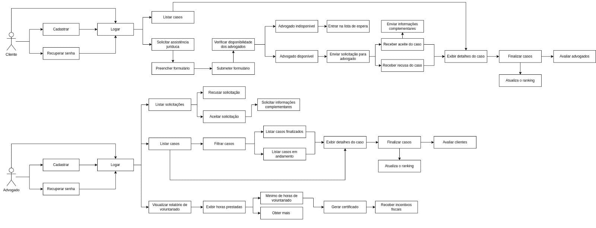

## 4. Modelo de Classes

> Diagrama e explicação do modelo de classes do sistema, incluindo a relação entre os componentes principais.

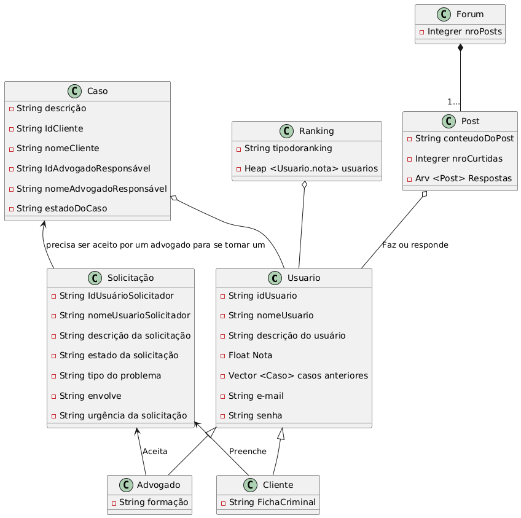

---

## 5. Modelo de Comportamento

### 5.1. UC - Fazer Postagem no Fórum

---

### 5.2. UC - Avaliar Advogado

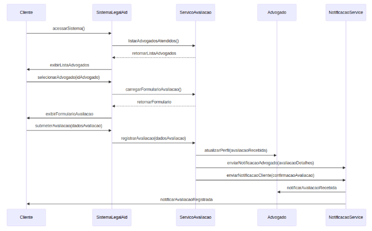

---

### 5.3. UC - Validar Caso Jurídico

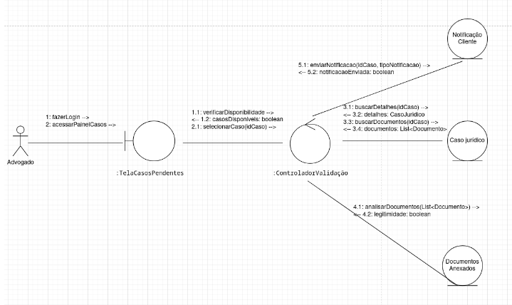
---

### 5.4. UC - Solicitar assistência jurídica

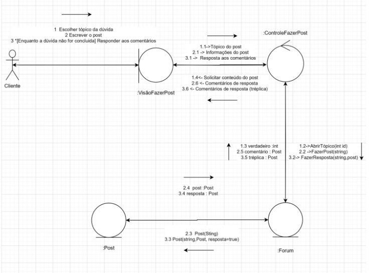

---

## 6. Modelos de Interações

### 6.1. UC - Fazer Postagem no Fórum
- **Descrição**: Mostra como o sistema processa uma postagem no fórum.
- **Diagrama de Interação**:  
  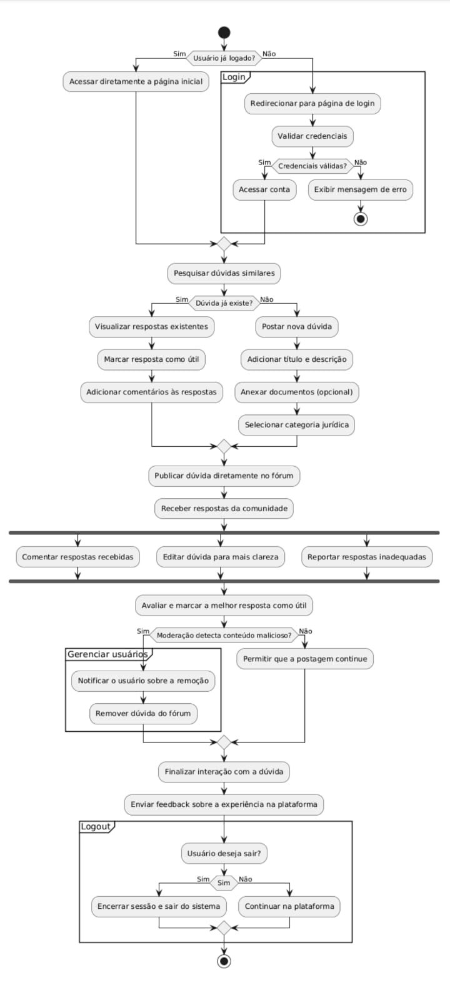

---

### 6.2. UC - Pedir Assistência Jurídica
- **Descrição**: Representa o fluxo de interação entre cliente e advogado para solicitar assistência jurídica.
- **Diagrama de Interação**:  
   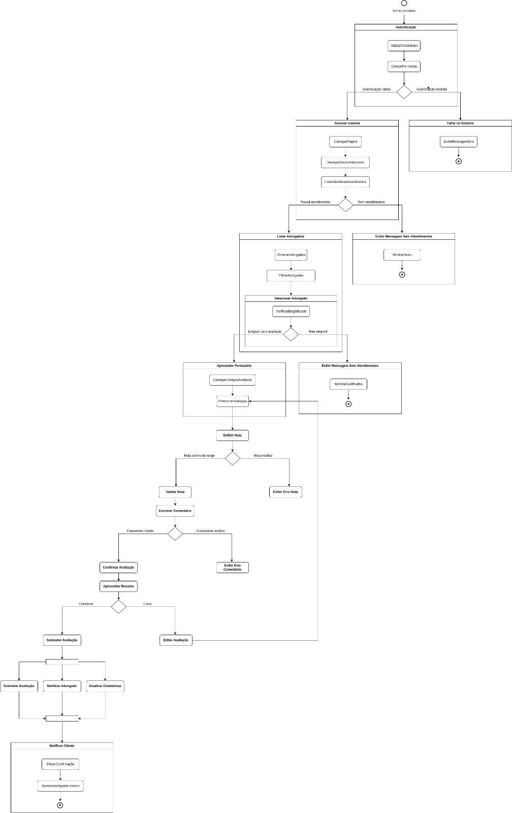

---

### 6.3. UC - Validar Caso Jurídico
- **Descrição**: Explica o processo de validação de casos jurídicos enviados pelos clientes.
- **Diagrama de Interação**:  
    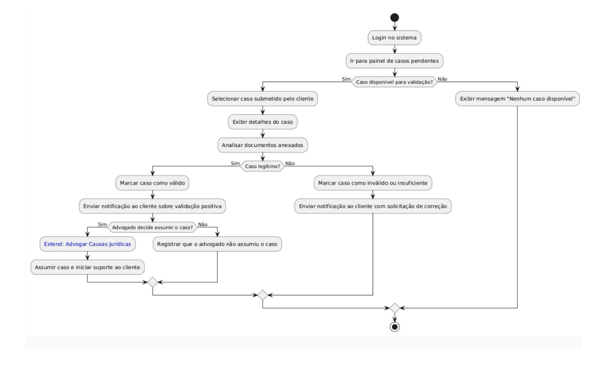

---

### 6.4. UC - Avaliar Advogado
- **Descrição**: Mostra como o cliente avalia um advogado e como o sistema processa essa avaliação.
- **Diagrama de Interação**:  
  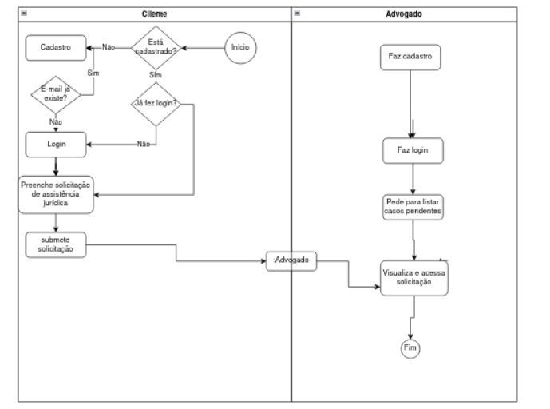

## 7. Código do Sistema

### 7.1. Tecnologia Selecionada

#### Framework de Desenvolvimento
- **Backend**: Utilizamos o Django, um framework robusto e de alto nível baseado em Python, que oferece suporte a programação orientada a objetos e segue o princípio DRY (Don't Repeat Yourself), otimizando o desenvolvimento e garantindo segurança e eficiência.

- **Frontend**: 
 Implementamos o frontend com uma combinação de Node.js para gerenciamento de dependências e ambiente de desenvolvimento, e bibliotecas adicionais para otimização da interface.

#### Linguagem de Programação Orientada a Objetos
- **Python**: Foi utilizado no backend devido à sua clareza e suporte completo à orientação a objetos, facilitando a modularidade e a manutenção do código.

#### Sistema de Gerenciamento de Banco de Dados Relacional
- **SQLite**: Banco de Dados leve e integrada ao Django, ideal para o ambiente de desenvolvimento e testes. Ele é um banco de dados relacional que permite armazenar, consultar e gerenciar informações de maneira eficiente.

#### Tecnologias e Ferramentas do Frontend
- **HTML5**: Estruturação das páginas e integração com o backend.
- **CSS**: Utilizado para criar estilos responsivos e design atrativo, garantindo acessibilidade em dispositivos móveis e desktops.
- **JavaScript**: Responsável por adicionar interatividade às páginas, validação de formulários e funcionalidades dinâmicas como envio assíncrono de dados ao servidor via AJAX.

#### Arquitetura e Integração
-Arquitetura baseada no padrão MVC (Model-View-Controller), fornecido pelo Django, separando a lógica de negócios (Model), as interações com o usuário (View) e o controle das requisições (Controller).
O frontend foi integrado ao backend por meio de APIs RESTful criadas no Django, garantindo uma comunicação eficiente entre cliente e servidor.

#### Gerenciamento de Dependências e Ferramentas de Desenvolvimento
- **Node.js**:  Utilizado para gerenciar bibliotecas e pacotes do frontend, otimizando o processo de desenvolvimento
- **Django Admin**: Ferramenta interna do Django para gerenciar dados, como usuários, advogados e casos, de forma eficiente.

#### Motivação das Escolhas Tecnológicas
A escolha do Django foi baseada na necessidade de uma solução escalável e segura para gerenciar dados e usuários.
O SQLite foi selecionado pela simplicidade e facilidade de integração com o Django.
A combinação de HTML, CSS e JavaScript garantiu um design moderno e uma experiência do usuário fluida, enquanto o uso do Node.js trouxe agilidade no desenvolvimento frontend.

---

### 7.2. Estrutura do Projeto
A estrutura do projeto segue um framework de desenvolvimento organizado:  
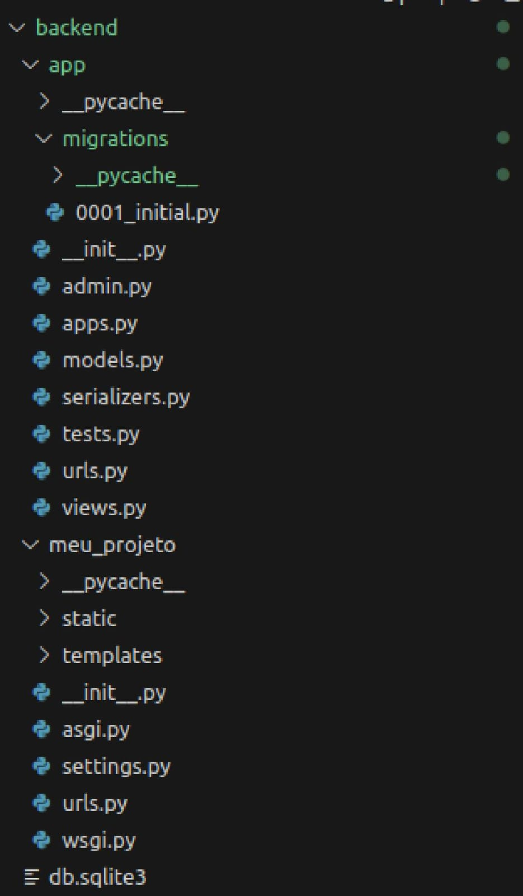

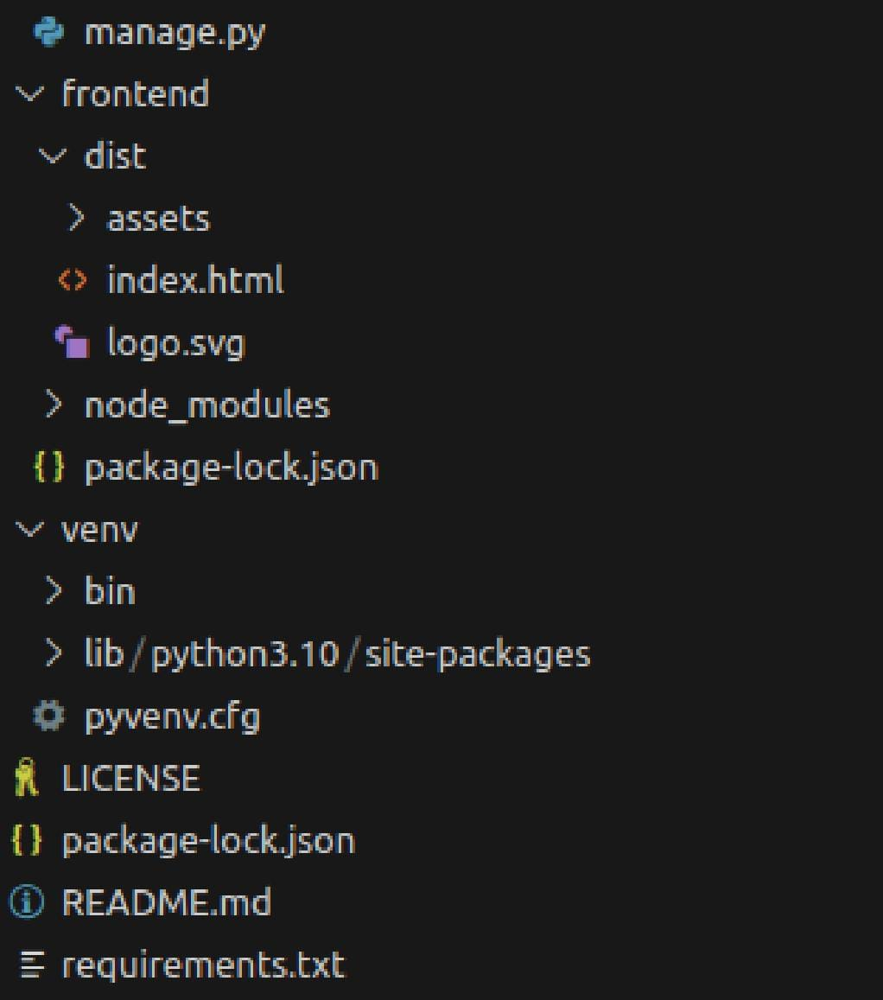

---

### 7.3. Link do Repositório
- [GitHub do Projeto](https://github.com/coqzieiro/site-legal-aid)

---

### 7.4. Explicação do Código Correspondente aos Casos de Uso Desenvolvidos

## 8. DISCUSSÕES

Durante o desenvolvimento do projeto, enfrentamos diversos desafios que acabaram por nos proporcionar um rico aprendizado. Um dos principais obstáculos foi lidar com o framework Django, uma tecnologia totalmente nova para a equipe. No início, a falta de experiência com Django trouxe certa insegurança, mas, com dedicação, estudo e seguindo tutoriais detalhados, conseguimos superar as dificuldades iniciais. Gradualmente, fomos entendendo o funcionamento do framework e conseguimos integrá-lo de forma eficiente ao backend do sistema. Essa jornada foi fundamental para que adquiríssemos confiança na utilização de uma ferramenta robusta e versátil como o Django.

Outro desafio significativo foi o desenvolvimento e configuração das rotas do frontend, garantindo uma integração fluida com o backend utilizando o Django. Essa tarefa exigiu não apenas compreensão das ferramentas, mas também a coordenação entre os membros da equipe para alinhar as interfaces com a lógica do sistema. Apesar das dificuldades, a persistência nos permitiu superar os obstáculos técnicos e criar um sistema coeso, funcional e bem estruturado.

O uso do banco de dados SQLite também foi uma novidade para todos os integrantes do grupo. Embora seja uma solução leve e integrada, sua implementação exigiu atenção e um estudo cuidadoso, pois precisávamos entender não apenas sua estrutura, mas também como conectá-la corretamente ao Django. Felizmente, seguindo um passo a passo detalhado e explorando a documentação oficial, conseguimos configurar e utilizar o SQLite de forma eficiente no nosso projeto, o que nos deu uma visão prática sobre a gestão de dados em sistemas reais.

O maior aprendizado, contudo, foi o trabalho em equipe. A colaboração eficiente foi a base para o sucesso do projeto. Desde o início, dividimos as tarefas de acordo com as aptidões e interesses de cada integrante. Cada um assumiu responsabilidades específicas, estudou as ferramentas necessárias e desenvolveu sua parte com dedicação. Quando chegou o momento de integrar os diferentes componentes do sistema, nos reunimos para explicar uns aos outros o que havíamos feito, alinhando as soluções e resolvendo possíveis conflitos de forma colaborativa. Essa experiência não apenas resultou em um sistema funcional, mas também fortaleceu nossa habilidade de comunicação, organização e trabalho em grupo.

Em resumo, este projeto não apenas nos desafiou tecnicamente, mas também nos ensinou valiosas lições sobre resiliência, aprendizado autodirigido e cooperação. Esses aprendizados certamente nos acompanharão em futuros projetos e em nossas trajetórias profissionais.

