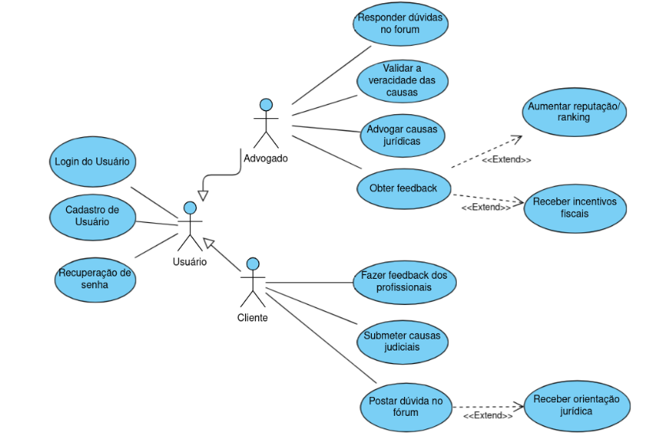

# System Direito ao Direito
Desenvolvimento de um site para gerenciamento de casos jurídicos.

## Como Executar o Projeto?

<h3>1. Frontend</h3>

<code>npm install</code> : Instala as dependências do node.js

<code>npm run dev</code> : Executa a interface do frontend localmente

<h3>2. Backend</h3> 

<code>source venv/bin/activate</code> : Ativa o ambiente virtual em python

<code>pip install -r requirements.txt</code> : Instala as dependências do Django

<code>python3 manage.py runserver</code> : Executa o servidor localmente

<code>deactivate</code> : Desativa o ambiente virtual em python

<h3>3. Usuários</h3>

*Cliente:*
- email: fersuaiden@gmail.com
- senha: fas123

*Advogado:*
- email: email@email.com
- senha: fas123

## 1. Introdução

O projeto visa desenvolver uma plataforma digital dedicada a oferecer assistência jurídica gratuita a pessoas de baixa renda em casos relacionados a direitos humanos, moradia e trabalho. O sistema conecta advogados voluntários a indivíduos que precisam de suporte legal, permitindo tanto a resolução de dúvidas em um fórum quanto a representação jurídica em casos "Pro Bono". O objetivo central é democratizar o acesso à justiça para aqueles que não podem pagar por serviços jurídicos, ao mesmo tempo em que oferece uma oportunidade para advogados recém-formados adquirirem experiência prática e para profissionais consolidados contribuírem para a sociedade.

A plataforma apresenta funcionalidades como login e cadastro de novos usuários, preenchimento de fichas detalhadas pelos clientes e ferramentas de feedback e avaliação. Com administração centralizada e moderação de conteúdo, o sistema busca garantir um ambiente organizado, eficiente e acessível, promovendo a inclusão social e a cidadania por meio do acesso a direitos fundamentais.

No desenvolvimento do sistema, utilizamos o Django como framework para o backend devido à sua robustez, segurança e facilidade de integração com bancos de dados. O Django permitiu uma estrutura bem organizada para lidar com as operações de criação, leitura, atualização e exclusão de dados (CRUD), além de oferecer uma administração interna que facilitou o gerenciamento inicial de usuários, advogados e casos registrados no sistema. Para o banco de dados, utilizamos o SQLite, que é leve e ideal para projetos em fase inicial, pois não requer uma configuração complexa e permite um desenvolvimento mais ágil.

No frontend, utilizamos uma combinação de tecnologias modernas para garantir uma interface interativa e de fácil uso. O Node.js foi empregado para gerenciar dependências e criar um ambiente de desenvolvimento eficiente, enquanto o CSS foi utilizado para estilização e criação de um design responsivo, garantindo que o sistema seja acessível em diferentes dispositivos, como computadores, tablets e smartphones. O JavaScript foi responsável por implementar a interatividade do site, como validação de formulários, envio de dados para o backend de forma dinâmica (AJAX) e outras funcionalidades que melhoram a experiência do usuário. Essa combinação de ferramentas permitiu a construção de um sistema funcional, intuitivo e escalável, adequado para os objetivos do projeto.


## 2. Especificação de Requisitos

### Cliente

1. **Submeter Caso Jurídico**  
   Como cliente que enfrenta dificuldades jurídicas e não possui recursos financeiros para contratar um advogado particular, eu gostaria de submeter meu caso jurídico na plataforma para que seja analisado por advogados voluntários, permitindo que eu receba assistência jurídica gratuita e adequada à minha situação, de forma rápida e confiável.

2. **Acessar Fórum de Dúvidas**  
   Como cliente que tem dúvidas sobre meus direitos ou procedimentos legais, eu gostaria de acessar um fórum onde pudesse postar minhas questões jurídicas, recebendo respostas de advogados voluntários que me ajudem a compreender melhor minha situação e tomar decisões informadas.

3. **Acessar Perfil do Advogado**  
   Como cliente que busca segurança e confiança no processo jurídico, eu gostaria de acessar o perfil do advogado que irá me representar, podendo visualizar informações como currículo, garantindo que ele seja qualificado para o meu caso.

4. **Avaliar Atendimento Jurídico**  
   Como cliente que valoriza a qualidade do serviço prestado, eu gostaria de poder avaliar o atendimento jurídico que recebi ao final do processo, preenchendo um formulário que permita dar feedback sobre a experiência, destacando pontos positivos e indicando melhorias.

5. **Receber Notificações**  
   Como cliente que precisa acompanhar o andamento do meu caso, eu gostaria de receber notificações automáticas da plataforma informando sobre atualizações, como a aceitação do caso por parte do advogado ou a necessidade de fornecer informações adicionais, para que eu esteja sempre ciente do progresso.


### Advogado

1. **Acessar Casos Disponíveis**  
   Como advogado voluntário que deseja usar meus conhecimentos para ajudar pessoas, eu gostaria de acessar a lista de casos jurídicos disponíveis na plataforma, para que eu possa escolher casos em que minha atuação seja mais efetiva.

2. **Validar Detalhes do Caso**  
   Como advogado voluntário que se preocupa em oferecer um atendimento responsável e eficiente, eu gostaria de poder revisar todos os detalhes do caso jurídico submetido pelo cliente, verificando a veracidade das informações e a legitimidade do problema, antes de decidir aceitar o caso e iniciar o atendimento.

3. **Responder Dúvidas no Fórum**  
   Como advogado voluntário que deseja contribuir com a sociedade, eu gostaria de ter acesso a um espaço na plataforma onde os clientes postam dúvidas jurídicas, para que eu possa responder essas questões de forma prática e acessível, ajudando a resolver problemas mais simples que não exigem acompanhamento formal.

4. **Acessar Feedback dos Clientes**  
   Como advogado voluntário que valoriza o reconhecimento pelo trabalho realizado, eu gostaria de poder acessar o feedback fornecido pelos clientes que atendi, entendendo como meu trabalho foi percebido e utilizando essas informações para melhorar minha atuação e aumentar minha reputação na plataforma.

5. **Visualizar Reputação/Ranking**  
   Como advogado voluntário que busca expandir minha experiência e reputação, eu gostaria de poder visualizar um ranking ou pontuação dentro da plataforma, que reflita meu engajamento e a qualidade dos atendimentos realizados, ajudando-me a ganhar maior visibilidade para atrair novos casos e oportunidades.


### 2.2 Personas

#### Clóvis – Advogado Voluntário  
Clóvis, de 22 anos, nasceu e foi criado em São Carlos. Ele é um
recém-formado do curso de Direito pela UFSCar, com objetivo de colocar em
prática os conhecimentos adquiridos na faculdade. Participou da Enactus
UFSCar durante sua graduação, de forma que entrou em contato com projetos
sociais e encontrou realização fazendo trabalhos que impactam positivamente a
comunidade. No início de sua carreira, ele busca ganhar experiência, aprimorar
suas habilidades jurídicas e, ao mesmo tempo, devolver algo para a sociedade que
investiu na sua formação.
Clóvis tem interesse em causas trabalhistas, já que vê nessa área uma
oportunidade de ajudar pessoas que durante seu tempo participando de projetos
sociais, ele encontrou muitas pessoas que passavam por injustiças no trabalho
por falta de suporte jurídico. Ele encontra no voluntariado uma oportunidade
para atacar esse problema, enquanto aumenta sua reputação em sua área de
atuação.


#### Yuri Alberto – Jogador de Beach Tênis  
Yuri Alberto, também com 22 anos, é natural de Cuiabá e se mudou para
São Carlos em busca de uma oportunidade de crescimento em sua carreira como
jogador de beach tênis. Ele foi contratado pelo Grêmio Osaac para jogar pelo
clube. Começou a jogar e estava bem, animado com a vida nova, contando
alegremente para a mãe sobre como estava tudo indo bem e feliz com a nova fase
da sua vida e o passo importante para a carreira de um atleta jovem. Porém, o
clube começou a sofrer uma crise financeira e há dois meses não paga o salário do
jogador.
Como ele está em uma cidade nova e ainda se adaptando, Yuri não possui
uma grande reserva financeira para lidar com essa situação. Ele se sente
inseguro em confrontar o clube, com medo de perder a oportunidade de continuar
jogando e, quem sabe, progredir na carreira. Essa situação o deixa ansioso e
preocupado com suas perspectivas futuras, já que precisa do dinheiro para se
manter na cidade.


### 2.3 Diagrama de Casos de Uso
  


### 2.4 Especificação de Casos de Uso Textuais Abstratos

- **Validar a Veracidade das Causas**: Advogados revisam as informações fornecidas pelos clientes e confirmam a legitimidade do problema.
- **Advogar Causas Jurídicas**: Advogados assumem casos jurídicos, fornecendo conselhos, preparando documentos ou representando os clientes.
- **Responder Dúvidas no Fórum**: Advogados respondem perguntas postadas pelos clientes no fórum, facilitando a resolução de problemas menores.
- **Submeter Causas Jurídicas**: Clientes enviam detalhes do problema jurídico, anexam documentos e aguardam avaliação de um advogado.
- **Postar Dúvidas no Fórum**: Clientes postam dúvidas no fórum para receber orientações rápidas dos advogados.
- **Receber Orientação Jurídica**: Clientes recebem respostas e orientações jurídicas com base nos detalhes fornecidos.
- **Fazer Feedback dos Profissionais**: Clientes avaliam o serviço dos advogados após o atendimento.
- **Obter Feedback**: Advogados acessam avaliações e comentários deixados pelos clientes.
- **Aumentar a Reputação/Ranking**: Advogados têm sua reputação aumentada com base no feedback positivo recebido.
- **Receber Incentivos Fiscais**: Advogados podem obter benefícios fiscais pelo serviço voluntário.
- **Login do Usuário**: Permite que advogados e clientes façam login na plataforma.
- **Cadastro de Usuário**: Usuários novos se cadastram informando dados básicos.
- **Recuperação de Senha**: Usuários podem recuperar o acesso por meio de redefinição de senha.


## 3. Arquitetura do Sistema

### 3.1 Componentes Explícitos do Sistema
Com base nos casos de uso feitos anteriormente, podemos identificar os seguintes componentes explícitos:

- **Componente de Assistência Jurídica**  
  - UC001: Solicitar Assistência Jurídica  
  - UC002: Validar Caso Jurídico  
  - UC003: Avaliar Advogado

- **Componente de Incentivos Fiscais**  
  - UC004: Receber Incentivos Fiscais

- **Componente de Interação em Fórum**  
  - UC005: Responder Dúvidas no Fórum

- **Componente de Reputação e Ranking**  
  - UC006: Aumentar Reputação/Ranking

### 3.2. Agrupamento dos Casos de Uso
- **Informações de Usuário:**  
  - UC001: Solicitar Assistência Jurídica  
  - UC003: Avaliar Advogado

- **Informações sobre Casos Jurídicos:**  
  - UC002: Validar Caso Jurídico  

- **Informações sobre Interações e Feedback:**  
  - UC005: Responder Dúvidas no Fórum  
  - UC006: Aumentar Reputação/Ranking  


### 3.3 Componentes Implícitos do Sistema
- **Sistema de Login/Autenticação:**  
  Necessário para validar o acesso de advogados e clientes, garantindo que apenas usuários cadastrados possam acessar os serviços.

- **Sistema de Notificação:**  
  Responsável por notificar advogados e clientes sobre atualizações, como novas assistências jurídicas, validações de casos, e atualizações no ranking.

- **Sistema de Gerenciamento de Feedback:**  
  Processa as avaliações feitas pelos clientes, garantindo que os advogados possam visualizar e acompanhar seu desempenho ao longo do tempo.

- **Sistema de Gestão de Filas de Espera:**  
  Necessário para gerenciar os casos onde não há advogados disponíveis imediatamente, conforme descrito no fluxo alternativo do UC001.

### 3.4 Diagrama de Arquitetura


## 4. Modelo de Classes

> Diagrama e explicação do modelo de classes do sistema, incluindo a relação entre os componentes principais.


---

## 5. Modelo de Comportamento

### 5.1. UC - Fazer Postagem no Fórum


---

### 5.2. UC - Avaliar Advogado


---

### 5.3. UC - Validar Caso Jurídico


---

### 5.4. UC - Solicitar assistência jurídica


---


## 6. Modelos de Interações

### 6.1. UC - Fazer Postagem no Fórum
- **Descrição**: Mostra como o sistema processa uma postagem no fórum.
- **Diagrama de Interação**:  
  

---

### 6.2. UC - Pedir Assistência Jurídica
- **Descrição**: Representa o fluxo de interação entre cliente e advogado para solicitar assistência jurídica.
- **Diagrama de Interação**:  
   

---

### 6.3. UC - Validar Caso Jurídico
- **Descrição**: Explica o processo de validação de casos jurídicos enviados pelos clientes.
- **Diagrama de Interação**:  
    

---

### 6.4. UC - Avaliar Advogado
- **Descrição**: Mostra como o cliente avalia um advogado e como o sistema processa essa avaliação.
- **Diagrama de Interação**:  
  

## 7. Código do Sistema

### 7.1. Tecnologia Selecionada

#### Framework de Desenvolvimento
- **Backend**: Utilizamos o Django, um framework robusto e de alto nível baseado em Python, que oferece suporte a programação orientada a objetos e segue o princípio DRY (Don't Repeat Yourself), otimizando o desenvolvimento e garantindo segurança e eficiência.

- **Frontend**: 
 Implementamos o frontend com uma combinação de Node.js para gerenciamento de dependências e ambiente de desenvolvimento, e bibliotecas adicionais para otimização da interface.

#### Linguagem de Programação Orientada a Objetos
- **Python**: Foi utilizado no backend devido à sua clareza e suporte completo à orientação a objetos, facilitando a modularidade e a manutenção do código.


#### Sistema de Gerenciamento de Banco de Dados Relacional
- **SQLite**: Banco de Dados leve e integrada ao Django, ideal para o ambiente de desenvolvimento e testes. Ele é um banco de dados relacional que permite armazenar, consultar e gerenciar informações de maneira eficiente.

#### Tecnologias e Ferramentas do Frontend
- **HTML5**: Estruturação das páginas e integração com o backend.
- **CSS**: Utilizado para criar estilos responsivos e design atrativo, garantindo acessibilidade em dispositivos móveis e desktops.
- **JavaScript**: Responsável por adicionar interatividade às páginas, validação de formulários e funcionalidades dinâmicas como envio assíncrono de dados ao servidor via AJAX.

#### Arquitetura e Integração
-Arquitetura baseada no padrão MVC (Model-View-Controller), fornecido pelo Django, separando a lógica de negócios (Model), as interações com o usuário (View) e o controle das requisições (Controller).
O frontend foi integrado ao backend por meio de APIs RESTful criadas no Django, garantindo uma comunicação eficiente entre cliente e servidor.


#### Gerenciamento de Dependências e Ferramentas de Desenvolvimento
- **Node.js**:  Utilizado para gerenciar bibliotecas e pacotes do frontend, otimizando o processo de desenvolvimento
- **Django Admin**: Ferramenta interna do Django para gerenciar dados, como usuários, advogados e casos, de forma eficiente.


#### Motivação das Escolhas Tecnológicas
A escolha do Django foi baseada na necessidade de uma solução escalável e segura para gerenciar dados e usuários.
O SQLite foi selecionado pela simplicidade e facilidade de integração com o Django.
A combinação de HTML, CSS e JavaScript garantiu um design moderno e uma experiência do usuário fluida, enquanto o uso do Node.js trouxe agilidade no desenvolvimento frontend.

---

### 7.2. Estrutura do Projeto
A estrutura do projeto segue um framework de desenvolvimento organizado: <br>
<p align="center">
  
  
</p>


### 7.3. Link do Repositório
- [GitHub do Projeto](https://github.com/coqzieiro/site-legal-aid)


### 7.4. Explicação do Código Correspondente aos Casos de Uso Desenvolvidos


### 7.4.1 Cadastro (Cliente ou Advogado)

#### **Frontend** - `Cadastro.jsx`
1. **Passo 1**: O usuário seleciona o tipo de conta (**cliente** ou **advogado**).
2. **Passo 2**:
   - **Cliente**: Preenche os campos de nome, e-mail e senha.
   - **Advogado**: Preenche os mesmos campos, adicionando o **número da licença de prática**.
3. **Passo 3**: Cliente e advogado fornecem um número de telefone como parte final do registro.

#### Funcionalidade Principal:
- O formulário envia os dados via **POST** para o endpoint `/api/register`.

```json
Exemplo de Payload:
{
  "userType": "advogado",
  "full_name": "João Silva",
  "email": "joao@exemplo.com",
  "password": "senha123",
  "practice_license_number": "123456"
}
```


#### **Backend** - `register_user` em `views.py`
1. A view recebe os dados e realiza as seguintes ações:
   - **Advogado**: Cria um objeto no modelo `Advogado`.
   - **Cliente**: Cria um objeto no modelo `Cliente`.
2. Verifica se o e-mail já existe antes de criar o registro.
3. A senha é armazenada de forma segura usando **`make_password`**.

**Resposta:**
- Sucesso: Retorna mensagem com o ID do usuário.
- Erro: Retorna mensagem indicando que o e-mail já está cadastrado.


### 7.4.2 Login (Cliente ou Advogado)

#### **Frontend** - `Login.jsx`
1. O usuário fornece **e-mail** e **senha**.
2. O formulário envia os dados via **POST** para o endpoint `/api/login`.
3. Após sucesso:
   - Salva os dados do usuário no **contexto global** (AuthContext).
   - Redireciona o usuário para a página inicial.

**Payload Enviado:**
```json
{
  "email": "joao@exemplo.com",
  "password": "senha123"
}
```


#### **Backend** - `login_user` em `views.py`
1. A view tenta autenticar o usuário:
   - Primeiro procura na tabela `Advogado`.
   - Se não encontrar, procura na tabela `Cliente`.
2. A senha é validada usando **`check_password`**.

**Resposta em caso de sucesso:**
```json
{
  "message": "Logged in successfully!",
  "user_id": 1,
  "user_type": "Advogado"
}
```


### 7.4.3 Solicitação de Assistência Jurídica (Cliente)

#### **Frontend** - `AssistenciaJuridica.jsx`
1. O cliente preenche um formulário com os seguintes campos:
   - Descrição do problema jurídico.
   - Tipo do problema (Contratos, Direito Penal, etc.).
   - Se envolve pessoa física ou jurídica.
   - Se há processos em andamento.
   - Grau de urgência.
   - Disponibilidade para consulta inicial.

**Exemplo de Payload:**
```json
{
  "user_id": 1,
  "descricao": "Preciso de ajuda com um contrato de trabalho.",
  "tipoProblema": "Direito trabalhista",
  "envolve": "Pessoa física",
  "processos": "False",
  "urgencia": "Alto",
  "consultou": "True",
  "disponibilidade": "Segunda-feira"
}
```

---

#### **Backend** - `create_solicitacao` em `views.py`
1. A view recebe os dados e cria um registro no modelo **Solicitacao**.
2. Armazena o **ID do cliente solicitante** e os detalhes fornecidos no formulário.

**Resposta:**
- Sucesso: Retorna mensagem confirmando o envio da solicitação.
- Erro: Retorna uma mensagem de erro.


### 7.4.4 Recebimento de Caso de Assistência Jurídica (Advogado)

#### **Frontend** - `VisualizarAssistencias.jsx`
1. O advogado acessa uma página que **lista as solicitações pendentes**.
2. A lista é carregada a partir do backend via **GET**.
3. Cada solicitação exibe:
   - Descrição do caso.
   - Tipo do problema jurídico.
   - Grau de urgência.
   - Disponibilidade do cliente.


#### **Backend** - `listar_solicitacoes` em `views.py`
1. A view filtra as solicitações com status **"pendente"** no modelo **Solicitacao**.
2. Retorna uma lista de solicitações em formato **JSON**.

**Exemplo de Resposta:**
```json
[
  {
    "id": 1,
    "descricaoSolicitacao": "Preciso de ajuda com um contrato de trabalho.",
    "tipoProblema": "Direito trabalhista",
    "urgencia": "Alto",
    "disponibilidade": "Segunda-feira"
  }
]
```


### 7.4.5 Fluxo Completo do Sistema

1. **Cadastro**:
   - Clientes e advogados se cadastram através de um formulário.
   - O backend cria registros nas tabelas apropriadas (**Cliente** ou **Advogado**).

2. **Login**:
   - O usuário fornece credenciais e o sistema valida as informações.
   - O tipo do usuário (Cliente ou Advogado) é retornado.

3. **Solicitação de Assistência Jurídica (Cliente)**:
   - O cliente preenche o formulário e envia uma solicitação.
   - O backend armazena a solicitação no banco de dados.

4. **Visualização de Solicitações (Advogado)**:
   - O advogado visualiza as solicitações pendentes.
   - Pode decidir entrar em contato ou aceitar o caso.


## 8. DISCUSSÕES

Durante o desenvolvimento do projeto, enfrentamos diversos desafios que acabaram por nos proporcionar um rico aprendizado. Um dos principais obstáculos foi lidar com o framework Django, uma tecnologia totalmente nova para a equipe. No início, a falta de experiência com Django trouxe certa insegurança, mas, com dedicação, estudo e seguindo tutoriais detalhados, conseguimos superar as dificuldades iniciais. Gradualmente, fomos entendendo o funcionamento do framework e conseguimos integrá-lo de forma eficiente ao backend do sistema. Essa jornada foi fundamental para que adquiríssemos confiança na utilização de uma ferramenta robusta e versátil como o Django.

Outro desafio significativo foi o desenvolvimento e configuração das rotas do frontend, garantindo uma integração fluida com o backend utilizando o Django. Essa tarefa exigiu não apenas compreensão das ferramentas, mas também a coordenação entre os membros da equipe para alinhar as interfaces com a lógica do sistema. Apesar das dificuldades, a persistência nos permitiu superar os obstáculos técnicos e criar um sistema coeso, funcional e bem estruturado.

O uso do banco de dados SQLite também foi uma novidade para todos os integrantes do grupo. Embora seja uma solução leve e integrada, sua implementação exigiu atenção e um estudo cuidadoso, pois precisávamos entender não apenas sua estrutura, mas também como conectá-la corretamente ao Django. Felizmente, seguindo um passo a passo detalhado e explorando a documentação oficial, conseguimos configurar e utilizar o SQLite de forma eficiente no nosso projeto, o que nos deu uma visão prática sobre a gestão de dados em sistemas reais.

O maior aprendizado, contudo, foi o trabalho em equipe. A colaboração eficiente foi a base para o sucesso do projeto. Desde o início, dividimos as tarefas de acordo com as aptidões e interesses de cada integrante. Cada um assumiu responsabilidades específicas, estudou as ferramentas necessárias e desenvolveu sua parte com dedicação. Quando chegou o momento de integrar os diferentes componentes do sistema, nos reunimos para explicar uns aos outros o que havíamos feito, alinhando as soluções e resolvendo possíveis conflitos de forma colaborativa. Essa experiência não apenas resultou em um sistema funcional, mas também fortaleceu nossa habilidade de comunicação, organização e trabalho em grupo.

Em resumo, este projeto não apenas nos desafiou tecnicamente, mas também nos ensinou valiosas lições sobre resiliência, aprendizado autodirigido e cooperação. Esses aprendizados certamente nos acompanharão em futuros projetos e em nossas trajetórias profissionais.


